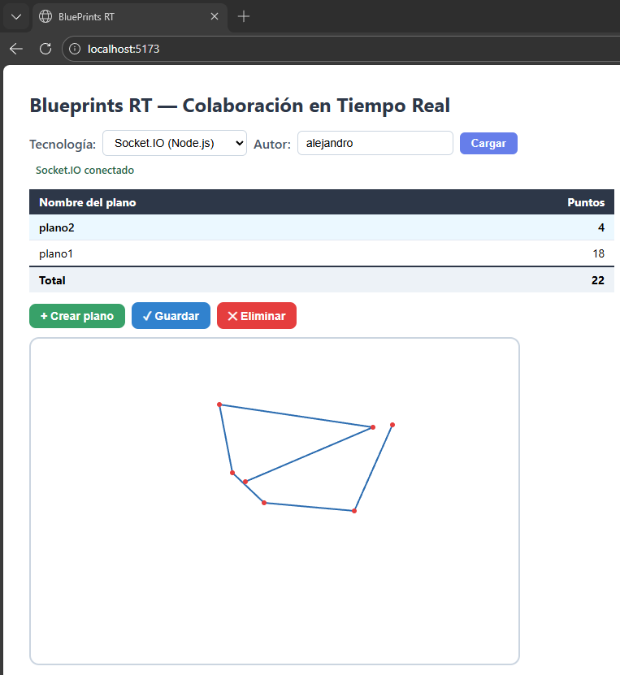

# Socket.IO — Gateway y Cliente para Blueprints RT

Implementación de colaboración en tiempo real mediante
Socket.IO en este proyecto: el gateway Node.js (puente hacia la API Spring Boot)
y el cliente frontend que consume ese gateway.

**Resumen:**
- **Gateway (Node.js + Socket.IO):** recibe eventos de los clientes, persiste
	puntos en el backend Spring Boot (REST) y retransmite el blueprint actualizado
	a todos los clientes conectados a la misma sala.
- **Frontend (React):** usa un wrapper `socketIoClient` y el hook
	[src/hooks/useSocketIoClient.js](src/hooks/useSocketIoClient.js) para gestionar la
	conexión; `useCanvas` soporta ahora un modo `socketio` para suscribirse a
	`blueprint-update` y enviar `draw-event`.

**Objetivo funcional:** permitir que varios usuarios colaboren dibujando sobre
el mismo blueprint; cada punto dibujado se persiste en la API y el estado
actualizado se envía en tiempo real a todos los clientes.

**Variables de entorno**
- `VITE_API_BASE` — URL base del API Spring Boot (ej. `http://localhost:8080`).
- `VITE_GATEWAY_URL` — URL del gateway Node.js Socket.IO (ej. `http://localhost:3000`).

**Gateway (comportamiento relevante)**
- Recibe `join-room` con payload `{ author, name }` → añade el socket a la
	sala `room:${author}-${name}` y envía inmediatamente un `blueprint-update`
	con el estado persistido si existe.
- Recibe `draw-event` con payload `{ author, name, point }` (punto `{x,y}`):
	1) Persiste el punto llamando a la REST API (`PUT /api/v1/blueprints/{author}/{name}/points`).
	2) Recupera el blueprint actualizado (`GET /api/v1/blueprints/{author}/{name}`).
	3) Emite `blueprint-update` a **todos** los sockets de la sala con
		 `io.to(room).emit('blueprint-update', <Blueprint>)` (esto incluye al
		 emisor — importante para que el cliente que originó el punto reciba el eco).
- Emite `warning` y `error` cuando hay problemas con Spring Boot o con el
	flujo de persistencia.

	Ejemplo (extracto simplificado del handler `draw-event` en el gateway):

	```js
	// server.js (gateway)
	socket.on('draw-event', async (payload, ack) => {
		// persistir punto en Spring Boot
		await persistPoint(payload.author, payload.name, payload.point)
		// recuperar blueprint actualizado
		const updated = await fetchBlueprint(payload.author, payload.name)
		// emitir a todos en la sala (incluido emisor)
		const room = `room:${payload.author}-${payload.name}`
		io.to(room).emit('blueprint-update', updated)
		if (typeof ack === 'function') ack({ ok: true })
	})
	```


Eventos principales (Gateway ↔ Cliente)
- Eventos entrantes (cliente → gateway):
	- `join-room`  — payload `{ author, name }` (une el socket a la sala)
	- `leave-room` — payload `{ author, name }` (sale de la sala)
	- `draw-event` — payload `{ author, name, point }`; admite callback de
		acknowledgement: el gateway responde con `{ ok: true }` o `{ ok: false, message }`.
- Eventos salientes (gateway → cliente):
	- `blueprint-update` — payload: objeto `Blueprint` completo (autor, nombre, points[])
	- `warning` / `error` — payload `{ message }`

Cliente — API de consumo
- [src/lib/socketIoClient.js](src/lib/socketIoClient.js):
	- `createSocketIoClient()` — crea y conecta un `socket.io-client` a
		`VITE_GATEWAY_URL`.
	- `joinRoom(socket, author, name)` / `leaveRoom(...)` — eventos de sala.
	- `subscribeBlueprintUpdate(socket, onUpdate)` — registra listener para
		`blueprint-update` y devuelve una función para anular la suscripción.
	- `sendDrawEvent(socket, author, name, point)` — envía `draw-event` y
		devuelve una `Promise` que se resuelve con el ack del servidor.

	Ejemplo de uso mínimo en el cliente:

	```js
	import { createSocketIoClient, joinRoom, subscribeBlueprintUpdate, sendDrawEvent } from './lib/socketIoClient'

	const socket = createSocketIoClient()
	socket.on('connect', () => {
	  joinRoom(socket, 'alice', 'house')
	  const un = subscribeBlueprintUpdate(socket, (bp) => render(bp.points))
	  // más tarde: un() para anular la suscripción
	})

	// enviar un punto (ack es una Promise que resuelve el ack del servidor)
	await sendDrawEvent(socket, 'alice', 'house', { x: 123, y: 45 })
	```

- [src/hooks/useSocketIoClient.js](src/hooks/useSocketIoClient.js): hook que
	gestiona la creación, listeners básicos (`connect`, `disconnect`, `error`)
	y la desconexión en el unmount. Expone `{ socket, connected }`.

- [src/hooks/useCanvas.js](src/hooks/useCanvas.js):
	- Soporta un parámetro unificado `transport` con `mode: 'stomp' | 'socketio'`.
	- En `socketio` hace `joinRoom(socket, author, name)` y usa
		`subscribeBlueprintUpdate` para recibir `blueprint-update` y actualizar el
		estado `points` con `bp.points`.
	- Para enviar puntos usa `sendDrawEvent(...)` y observa el ack para logging.

	Extracto de integración en `useCanvas` para el modo `socketio`:

	```js
	useEffect(() => {
	  if (mode === 'socketio' && connected && socket) {
	    joinRoom(socket, author, name)
	    const unsub = subscribeBlueprintUpdate(socket, (bp) => setPoints(bp.points ?? []))
	    return () => { unsub(); leaveRoom(socket, author, name) }
	  }
	}, [mode, socket, connected, author, name])
	```

Integración con la UI
- [src/App.jsx](src/App.jsx) ahora instancía ambos transportes (condicionalmente):
	- `useStompClient(tech === 'stomp')` → `{ client, ready }`
	- `useSocketIoClient(tech === 'socketio')` → `{ socket, connected }`
	- `useCanvas` recibe `{ mode, client, ready, socket, connected }` y
		selecciona el comportamiento apropiado.

Pasos para ejecutar localmente
1. Arrancar la API Spring Boot en `http://localhost:8080`.
2. Ejecutar el gateway Node.js en `http://localhost:3000`:

```bash
npm start
```

3. Iniciar el frontend :

```bash
npm install
npm run dev
```

4. En la UI, seleccionar `Socket.IO (Node.js)` en el selector de
	 tecnología y abrir dos ventanas/usuarios con el mismo autor y blueprint.
	 Dibujar desde una ventana debe verse reflejado en la otra en tiempo real.
    
**Comparativa breve — STOMP vs Socket.IO**

- **STOMP (Spring Boot broker)**
	- Pros: Integración nativa con Spring (`/ws-blueprints` + `SimpleBroker`), patrón pub/sub estándar, el broker redistribuye a todos los suscriptores (incluido el emisor) y la lógica queda centralizada en el servidor.
	- Contras: depende del stack de Spring (menos flexible para personalizaciones en el gateway), requiere soporte STOMP en el servidor y puede tener más sobrecarga de protocolo frente a soluciones ligeras.

- **Socket.IO (Node.js gateway)**
	- Pros: API de cliente rica (reconexión automática, acknowledgements, fallbacks), alto control en el gateway (permite adaptar persistencia, validaciones y autorización), fácil de usar desde clientes JS.
	- Contras: implica un componente adicional (gateway) y un doble salto hacia la API REST (cliente → gateway → Spring), lo que añade complejidad operacional y puntos de fallo; la consistencia se debe garantizar explícitamente en el gateway.

Recomendación corta: use **STOMP** cuando la arquitectura se apalanca en Spring y se prefiera un broker integrado; use **Socket.IO** cuando se necesite flexibilidad cliente-side, acknowledgements o lógica de gateway personalizada. En ambos casos la API REST es la fuente de verdad (persistencia) y el servidor debe garantizar que el blueprint enviado a clientes es la versión persistida.


