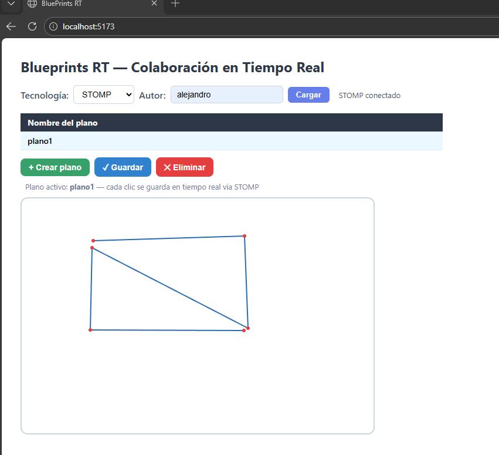

# STOMP (WebSocket) 

Documentacion de como el frontend usa STOMP sobre WebSocket para la sincronización en tiempo real de blueprints.


## Resumen de arquitectura

- Endpoint WebSocket (handshake) del backend: `/ws-blueprints`
- Prefijo de aplicación para mensajes entrantes: `/app` (ej. `/app/draw`)
- Prefijo para el broker/redistribución a clientes: `/topic`
- Convención de topic por plano: `/topic/blueprints.{author}.{name}`

El frontend: conecta al WebSocket, se suscribe al topic del blueprint activo y publica puntos a `/app/draw`. El servidor persiste el punto y reenvía el blueprint completo a todos los suscriptores.

## Variables de entorno y URL 

- `VITE_API_BASE` — URL base de la API (por defecto `http://localhost:8080`).

El cliente STOMP construye la URL del WebSocket derivada de `VITE_API_BASE` transformando `http(s)` → `ws(s)` y añadiendo `/ws-blueprints`:

```javascript
const WS_URL = `${(import.meta.env.VITE_API_BASE ?? 'http://localhost:8080')
  .replace(/^http/, 'ws')}/ws-blueprints`
```

## Conexión del cliente STOMP

```js
import { Client } from '@stomp/stompjs'

function createStompClient(wsUrl) {
  return new Client({
    brokerURL: wsUrl,
    reconnectDelay: 3000,
    heartbeatIncoming: 10000,
    heartbeatOutgoing: 10000,
    onStompError: (frame) => console.error('STOMP error', frame.headers),
  })
}

// Uso
const client = createStompClient(WS_URL)
client.onConnect = () => { /* ready */ }
client.activate()
// client.deactivate() para cerrar
```

El hook `useStompClient(enabled)` crea y activa el cliente cuando `enabled === true`, expone `{ client, ready }` y desactiva al desmontar o cuando `enabled` pasa a `false`.

## Suscripción a topics

Cada blueprint tiene un topic único. Al cambiar de plano el cliente debe:

1. Cancelar la suscripción anterior: `subscription.unsubscribe()`.
2. Suscribirse al nuevo topic: `client.subscribe(`/topic/blueprints.${author}.${name}`, handler)`.

```js
function subscribeToBlueprint(client, author, name, onMessage) {
  const topic = `/topic/blueprints.${author}.${name}`
  return client.subscribe(topic, (frame) => {
    const blueprint = JSON.parse(frame.body)
    onMessage(blueprint)
  })
}
```

El `onMessage` debe reemplazar el estado del canvas con la versión enviada por el servidor.

## Publicación de eventos de dibujo

El cliente publica cada clic en `/app/draw`. El servidor procesa el mensaje (persiste) y reenvía la representación completa del blueprint.

```js
function publishPoint(client, author, name, point) {
  if (!client.connected) return
  client.publish({
    destination: '/app/draw',
    body: JSON.stringify({ author, name, point }),
  })
}
```

## Integración con `useCanvas`

- `useCanvas` realiza:
  - Carga inicial por REST (`GET /api/v1/blueprints/{author}/{name}`) y setPoints con puntos persistidos.
  - Suscripción STOMP cuando `client` está conectado (`ready === true`).
  - Recepción de mensajes STOMP → `setPoints(bp.points)`.
  - `sendPoint(x,y)` que llama `publishPoint(client, author, name, {x,y})`.

La separación REST vs STOMP:
- REST: estado inicial y operaciones CRUD.
- STOMP: sincronización incremental y colaborativa.

## Integración con la API REST

El cliente combina REST y STOMP: REST se usa para obtener el estado inicial y para operaciones CRUD; STOMP se usa para sincronización en tiempo real.

Endpoints backend:

- `GET /api/v1/blueprints/{author}` → lista de blueprints del autor. El frontend mapea cada elemento a `{ name, author, pointCount }` para la tabla del autor.
- `GET /api/v1/blueprints/{author}/{name}` → blueprint completo con `points` (usado para poblar el canvas al seleccionar un plano).
- `POST /api/v1/blueprints` → crear un blueprint nuevo. Payload: `{ author, name, points }`.
- `PUT /api/v1/blueprints/{author}/{name}/points` → agrega un único punto al blueprint (este endpoint lo invoca el servidor cuando procesa un evento STOMP).
- `DELETE /api/v1/blueprints/{author}/{name}` → elimina un blueprint.

Contrato de respuestas:

El backend devuelve un envoltorio `ApiResponse` con `{ status, message, data, timestamp }`. El módulo `src/lib/blueprintApi.js` centraliza las llamadas HTTP y extrae `data` antes de devolverla; además lanza `Error` cuando la respuesta HTTP no es `2xx`.

Uso en los hooks del frontend:

- `useBlueprints(author)` llama a `getBlueprintsByAuthor(author)` para poblar la tabla y calcular `totalPoints`. Las operaciones `create` y `remove` usan `createBlueprint` y `deleteBlueprint` y luego recargan la lista.
- `useCanvas(client, ready, author, name)` invoca `getBlueprint(author, name)` al seleccionar un plano para obtener los puntos iniciales. Después se suscribe al topic STOMP correspondiente.

## Como probar y ejecutar

1. Iniciar el servidor spring con el backend `http://localhost:8080/`
2. Iniciar el frontend `http://localhost:5173/`
3. Selecionar Tecnologia STOMP, Autor y un plano
4. Abrir simultaneamente otro navegador para ver real time  

